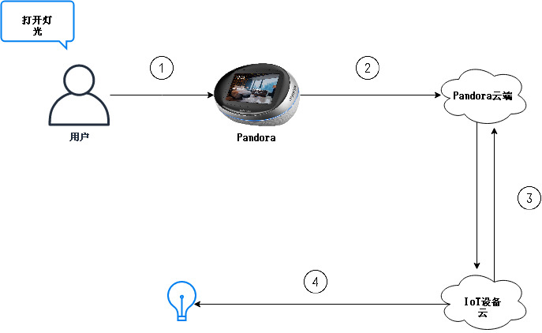

# 简介

## 接入方式整体架构图

## 交互说明

1. 用户语音输入
2. Pandora云端进行语音识别，语义理解
3. Pandora云端与IoT云之间指令下发与响应
4. IoT云指令下发到具体设备


\#3支持_**同步**_与_**异步**_方式，详细交互流程略有不同，后面章节有详细描述，见：[USH IoT接入流程](ush-iot-jie-ru-liu-cheng.md)


