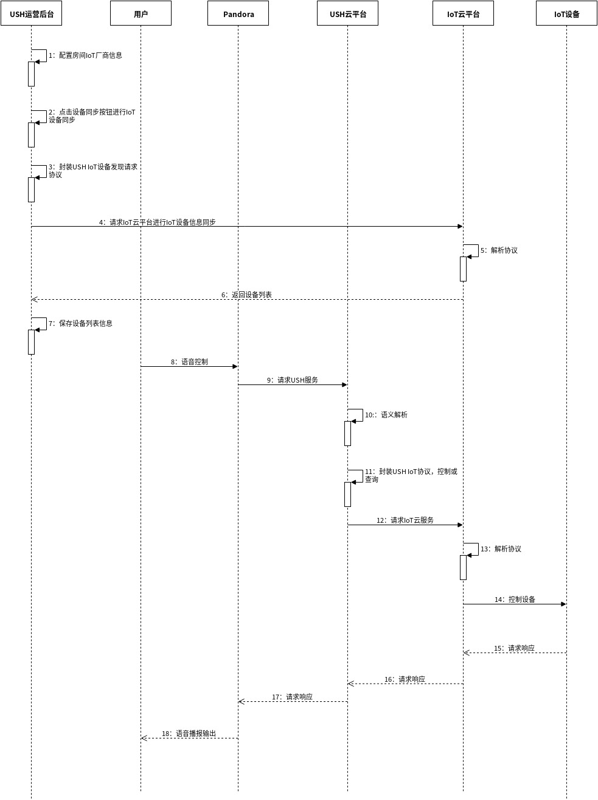

# USH IoT接入流程

## 一.准备阶段

1. 提供OAuth2.0授权相关信息
   1. response\_type：固定值code
   2. 授权地址：IoT厂商授权地址URL
   3. client\_id：IoT厂商为USH分配的client\_id
   4. client\_secret：IoT厂商为USH分配的client\_secret
   5. token获取地址：IoT厂商获取AccessToken的地址
2. 提供IoT网关相关信息
   1. IoT网关接口URL


USH对IoT云接入认证需遵循OAuth2.0接入规范，参考[https://oauth.net/2/](https://oauth.net/2/)


### OAuth2.0协议流程

> ```text
>      +--------+                               +---------------+
>      |        |--(A)- Authorization Request ->|   Resource    |
>      |        |                               |     Owner     |
>      |        |<-(B)-- Authorization Grant ---|               |
>      |        |                               +---------------+
>      |        |
>      |        |                               +---------------+
>      |        |--(C)-- Authorization Grant -->| Authorization |
>      | Client |                               |     Server    |
>      |        |<-(D)----- Access Token -------|               |
>      |        |                               +---------------+
>      |        |
>      |        |                               +---------------+
>      |        |--(E)----- Access Token ------>|    Resource   |
>      |        |                               |     Server    |
>      |        |<-(F)--- Protected Resource ---|               |
>      +--------+                               +---------------+
> ```

## 二.智能家居接入流程

USH智能家居接入流程分为同步与异步两种模式

### 同步模式



